# 🚐 VanLife — React Router & Firebase

A modern van rental platform built with **React**, **React Router**, and **Firebase Firestore**.

This project was created to master advanced React Router concepts including nested routes, dynamic routing, protected routes, route layouts, outlet context, data fetching, and Firebase integration.

The application allows users to browse available vans, view detailed information, authenticate into the platform, and access a protected Host Dashboard for managing listed vans.

---

## 🎥 Project Walkthrough

A complete screen-recorded walkthrough of the application is included in this repository.

### Features Demonstrated

✅ Home Page

✅ About Page

✅ Vans Marketplace

✅ Van Details Page

✅ Dynamic Route Parameters

✅ Firebase Firestore Data Fetching

✅ Login Authentication

✅ Protected Routes

✅ Host Dashboard

✅ Host Income Page

✅ Host Reviews Page

✅ Host Van Management

✅ Nested Routing

✅ Layout Routes

✅ Outlet Context

---

## 📸 Application Screenshots

### Home Page

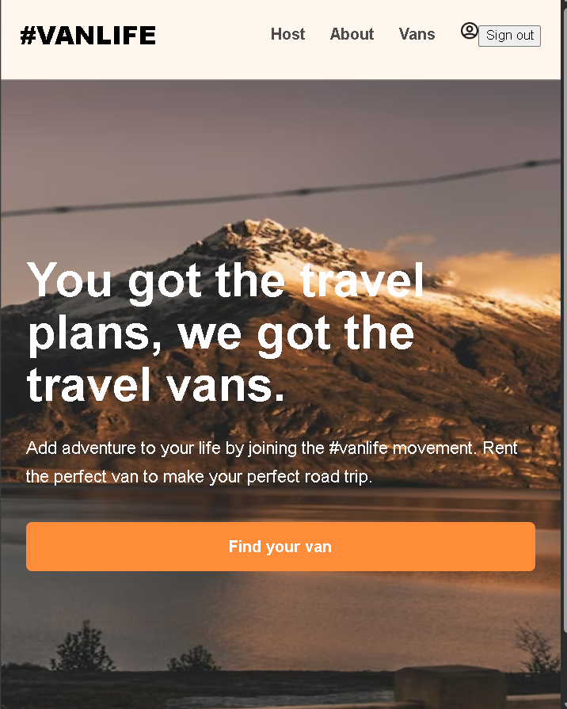

### About Page

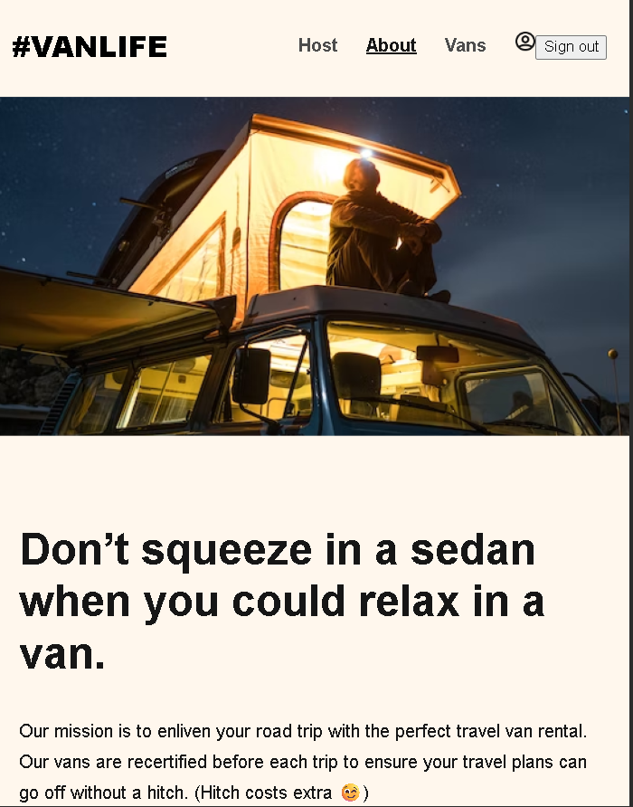

### Vans Marketplace

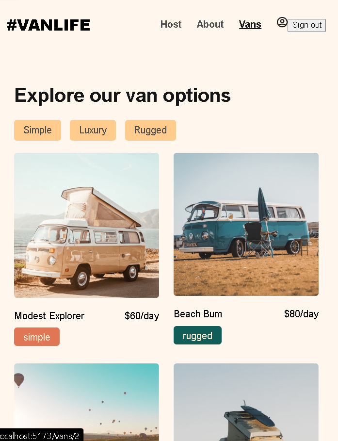

### Authentication

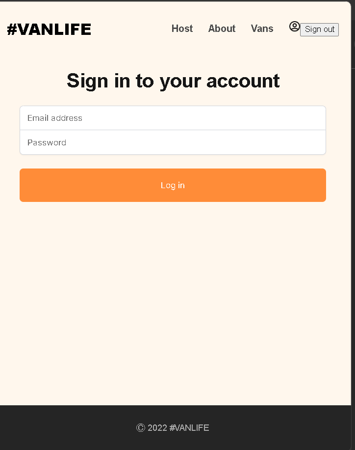

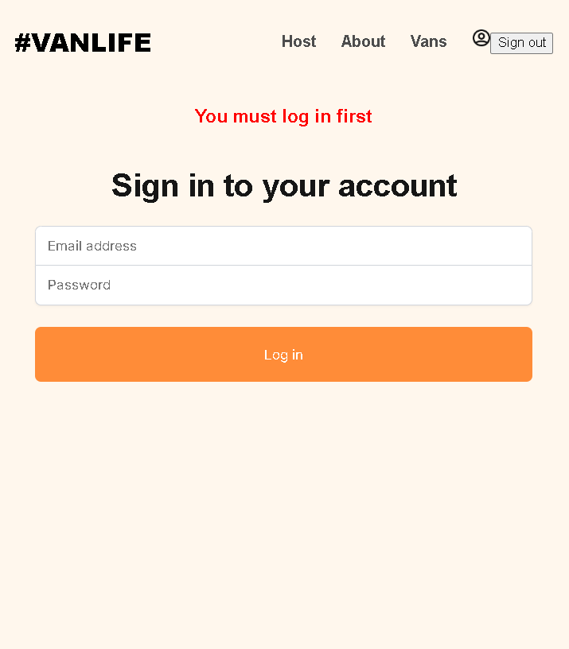

### Host Dashboard

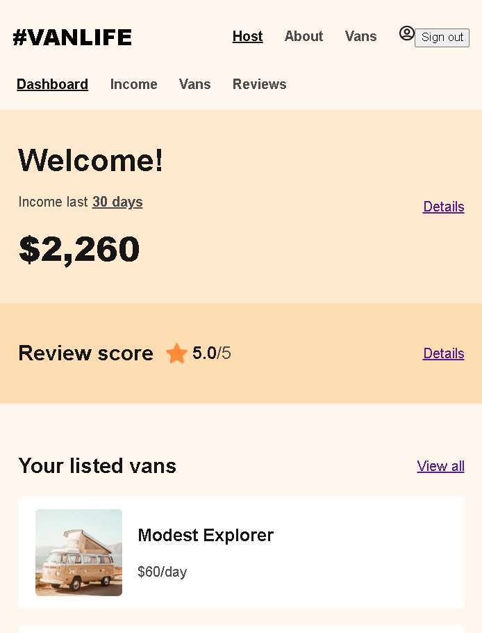

### Host Income

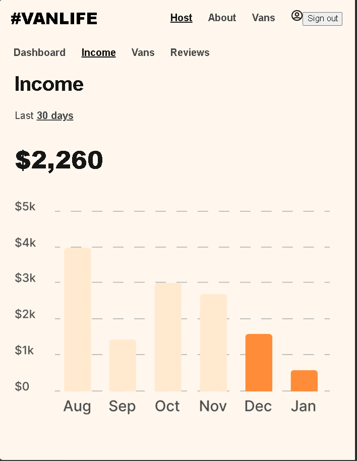

### Host Vans

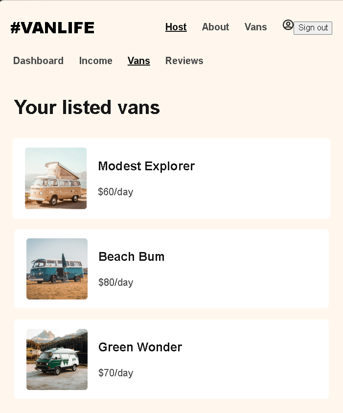

### Host Van Details

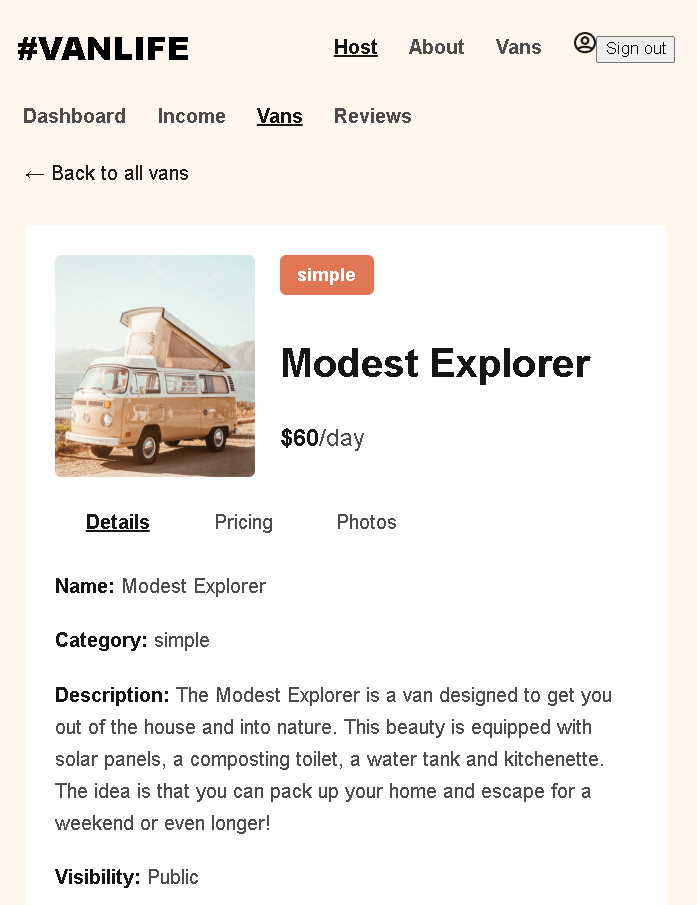

### Host Van Pricing

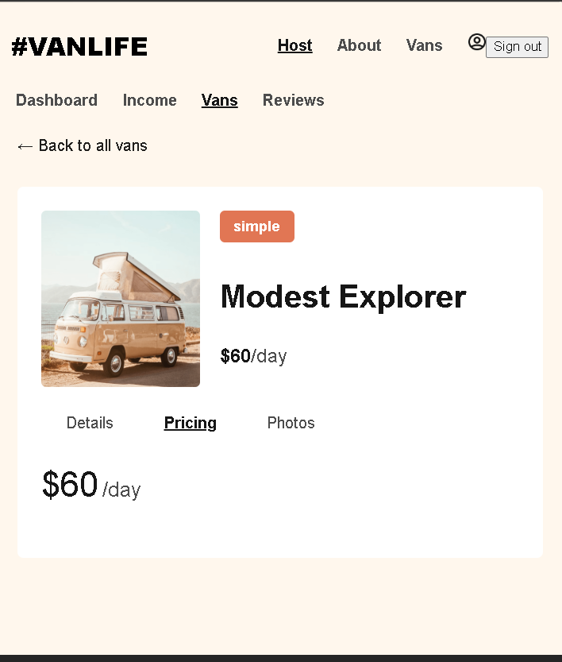

### Host Van Photos

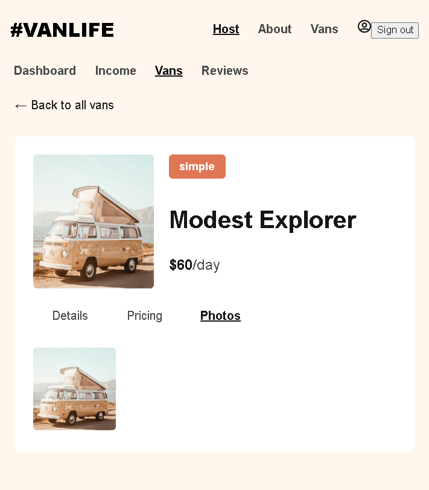

### Host Reviews

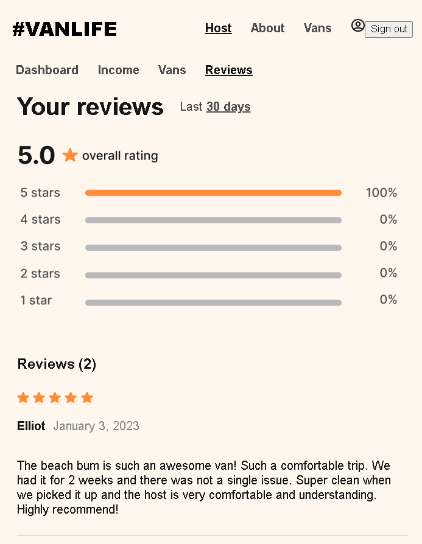

---

# 🚀 Technologies Used

### Frontend

- React
- React Router DOM
- JavaScript (ES6+)
- CSS3
- Vite

### Backend / Database

- Firebase Firestore

### Development Tools

- Git
- GitHub
- VS Code

---

# ✨ Key React Router Concepts Implemented

This project heavily focuses on React Router and includes:

### Nested Routes

```jsx
<Route path="host" element={<HostLayout />}>
```

### Dynamic Routes

```jsx
<Route path="vans/:id" />
```

### Route Parameters

```jsx
const { id } = useParams()
```

### Protected Routes

```jsx
<AuthRequired />
```

### Layout Routes

```jsx
<Outlet />
```

### Relative Navigation

```jsx
<Link to=".." relative="path" />
```

### Active Navigation Styling

```jsx
<NavLink />
```

### Outlet Context

```jsx
<Outlet context={data} />
```

---

# 🔥 Firebase Features

The application uses Firebase Firestore as the primary data source.

### Collections

```text
vans
users
```

### Firestore Operations

- getDocs()
- getDoc()
- query()
- where()

### Example

```javascript
const snapshot = await getDocs(vansCollectionRef)

const vans = snapshot.docs.map(doc => ({
    ...doc.data(),
    id: doc.id
}))
```

---

# 🔐 Authentication Features

The project includes a complete authentication flow:

- Login Page
- Protected Routes
- Redirect After Login
- Authentication Persistence
- Host Dashboard Protection

Users attempting to access protected pages are redirected to login first.

---

# 📁 Project Structure

```text
src
│
├── homeComponents
│   ├── Home.jsx
│   ├── About.jsx
│   ├── Vans.jsx
│   ├── VanDetail.jsx
│   ├── Login.jsx
│   ├── Header.jsx
│   ├── Footer.jsx
│   └── HomeLayout.jsx
│
├── hostComponents
│   ├── Dashboard.jsx
│   ├── HostLayout.jsx
│   ├── HostVans.jsx
│   ├── HostVanDetail.jsx
│   ├── Details.jsx
│   ├── Pricing.jsx
│   ├── Photos.jsx
│   ├── Income.jsx
│   └── Reviews.jsx
│
├── api.js
├── AuthRequired.jsx
├── NotFound.jsx
├── App.jsx
└── App.css
```

---

# ⚙️ Environment Variables

Firebase credentials are stored using environment variables.

Create a `.env` file:

```env
VITE_FIREBASE_API_KEY=YOUR_API_KEY
VITE_FIREBASE_AUTH_DOMAIN=YOUR_AUTH_DOMAIN
VITE_FIREBASE_PROJECT_ID=YOUR_PROJECT_ID
VITE_FIREBASE_STORAGE_BUCKET=YOUR_STORAGE_BUCKET
VITE_FIREBASE_MESSAGING_SENDER_ID=YOUR_SENDER_ID
VITE_FIREBASE_APP_ID=YOUR_APP_ID
```

---

# 🛠 Installation

Clone the repository:

```bash
git clone https://github.com/ThisisAlam/van-life-app-react-router.git
```

Navigate into project:

```bash
cd van-life-app-react-router
```

Install dependencies:

```bash
npm install
```

Start development server:

```bash
npm run dev
```

---

# 🎯 Learning Outcomes

This project helped me gain practical experience with:

- Advanced React Router
- Nested Route Architecture
- Dynamic Routing
- Protected Routes
- Firebase Firestore
- Authentication Flows
- Environment Variables
- Data Fetching Patterns
- State Management
- Component Composition

---

# 🔮 Future Improvements

- Firebase Authentication
- User Registration
- Real Booking System
- Admin Dashboard
- Payment Integration
- Favorites / Wishlist
- Better Analytics
- Dark Mode
- Enhanced Mobile Experience

---

# 👨‍💻 Author

### Fakhar E Alam

Frontend Developer | React Developer | Full Stack Engineering Student

GitHub:
https://github.com/ThisisAlam

LinkedIn:
https://www.linkedin.com/in/fakhar-e-alam-a046133b4/

---

# ⭐ Support

If you enjoyed this project or found it useful, consider giving it a ⭐ on GitHub.

It helps support my learning journey and future open-source projects.

🚀 Built with React, React Router & Firebase
